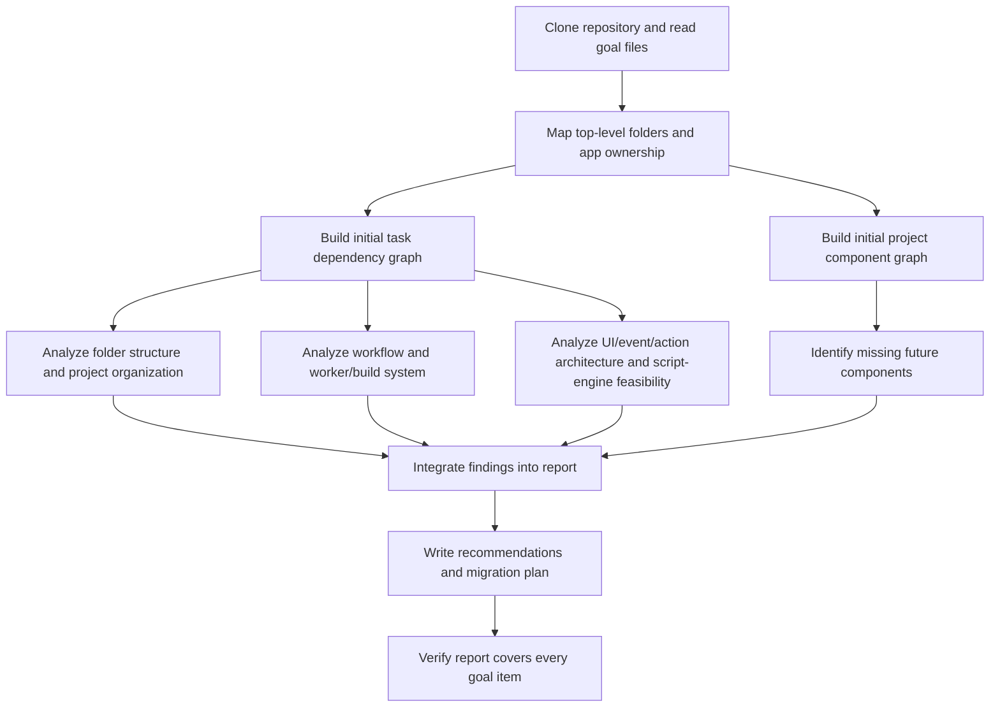
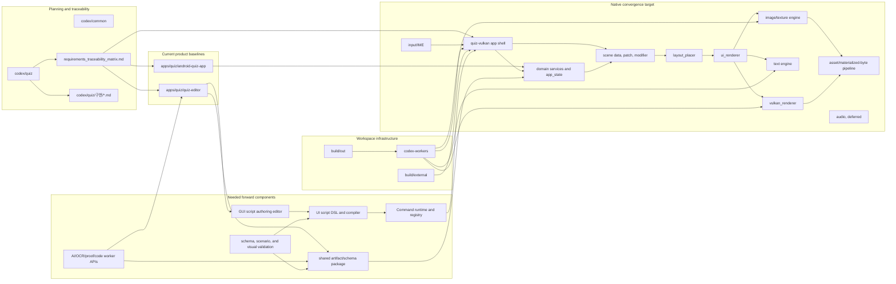

# cpp-env project structure and UI engine feasibility report

Repository: `https://github.com/pjuny0301/cpp-env`  
Analyzed commit: `00ae55c9121546b2e5d9986380623df2137d8929`

## A. Task Dependency Graph



Independent paths after the first two graphs:

| Path | Work area | Output expected |
| --- | --- | --- |
| P1 | `README.md`, `AGENTS.md`, `apps/`, `codex/`, `build/` | Folder/project organization inefficiencies |
| P2 | `codex-workers/`, CMake/build/test docs | Workflow and long-lived worker inefficiencies |
| P3 | `apps/quiz/quiz-vulkan/src/core/ui`, `src/core/scene`, `src/app`, React app references | UI engine/script feasibility |
| P4 | docs, requirement matrix, app source boundaries | Component graph gaps and future components |

## B. Project Component Graph



## Executive Summary

The project direction is viable. The repository already has the most important architectural precondition for a GUI-authored UI engine: app/domain state is separated from scene data, layout, UI draw-list generation, and Vulkan rendering. The existing path is:

```text
platform/app shell
  -> input/app action routing
      -> app_state action dispatcher
          -> domain services
          -> app_snapshot
  -> scene modifier / scene patch
      -> scene_layout_data
          -> layout_placer
              -> ui_renderer
                  -> vulkan_renderer
```

The planned `onEvent -> Command -> invokeSomething` model fits this architecture, but it should not be implemented inside `ui_renderer`. The correct target is the current gap between `scene_action_binding` and `app_action_router`. Today, scene nodes bind a string `action_type` and a string `payload`; the next step is to replace or wrap that with a typed `Command(name, args)` object and a command registry.

Main conclusion:

- Feasible: yes.
- Major renderer rewrite needed: no.
- Major schema/runtime/editor work needed: yes.
- Best path: keep the current C++ pipeline, add a structured scene-script layer, then move `app_quiz_screens.h` screen construction from C++ helper code toward data-driven templates.

## Evidence Base

Primary project sources inspected:

- `README.md` and `AGENTS.md` for top-level ownership rules.
- `codex/quiz/current.md`, `codex/quiz/big_plan.md`, and `codex/quiz/requirements_traceability_matrix.md` for current plan and status.
- `apps/quiz/quiz-vulkan/docs/architecture.md`, `scene-schema.md`, `domain-contract.md`, and `test-plan.md`.
- `apps/quiz/quiz-vulkan/src/app`, `src/core/domain`, `src/core/scene`, `src/core/layout`, `src/core/ui`, `src/render`.
- `apps/quiz/android-quiz-app` and `apps/quiz/quiz-editor` for current React baselines.
- `codex-workers` scripts and prompts for workflow analysis.

Parallel analysis sessions:

| Session | Scope | Result used |
| --- | --- | --- |
| `s-structure` | folder structure, app/document ownership | duplication and organization risks |
| `s-workflow` | worker/build/test workflow | tmux, build lock, branch, and path risks |
| `s-ui-engine` | UI/event/action/script feasibility | `Command(args)` migration plan |

Coordination record: `coordination/SHARED_NOTES.md`.

## Current Project Structure

Top-level layout:

- `apps/`: product source workspaces.
- `apps/quiz/android-quiz-app`: current Android-first learning UX baseline.
- `apps/quiz/quiz-editor`: current authoring/editor baseline.
- `apps/quiz/quiz-vulkan`: native C++23/Vulkan remake and convergence target.
- `codex/`: Codex-side requirements, planning, implementation mapping, and worker context.
- `codex/quiz`: quiz-specific requirements, daily snapshots, implementation notes, traceability matrix.
- `codex-workers`: long-lived worker prompts and helper scripts for parallel engine work.
- `build/external`: reusable external libraries, tools, dependency snapshots, app data, editor settings.
- `build/out`: intended ignored output location for generated build/test artifacts.

The high-level separation is sound. The main weakness is not the top-level folder taxonomy; it is the amount of duplicated detail below it.

## Inefficient Structure And Organization

### 1. Requirements And Implementation Notes Are Over-Replicated

The requirements system has a useful idea: requirement IDs are traceability IDs, while execution order comes from `big_plan.md`. In practice, similar implementation notes appear across:

- `codex/quiz/구현/*.md`
- `codex/quiz/일자별요구사항/2026-04-27/구현/*.md`
- `codex/quiz/android-quiz-app/구현/*.md`
- `codex/quiz/android-quiz-app/일자별요구사항/.../구현/*.md`
- `codex/quiz/quiz-editor/구현/*.md`
- `codex/quiz/quiz-vulkan/구현/*.md`

This makes it hard to know which document is authoritative. It also raises the cost of updating a requirement because the same conceptual change can appear in multiple mirrored paths.

Recommendation:

- Make `codex/quiz/requirements_traceability_matrix.md` the index.
- Make `codex/quiz/구현/NN.md` only a routing/decision summary.
- Keep detailed implementation plans only under the owning project, for example `codex/quiz/quiz-vulkan/구현/NN.md`.
- Convert dated folders into immutable snapshots with a manifest that points to the authoritative current files instead of duplicating all content.

### 2. React Baseline Apps Duplicate Generated UI

`apps/quiz/android-quiz-app` and `apps/quiz/quiz-editor` both contain identical generated UI wrappers:

- `src/app/components/ui`: 48 files in each app, `diff -qr` showed no differences.
- `src/styles`: duplicated.
- `src-tauri/icons`: duplicated.
- `package.json`: almost identical dependency set.

This duplication is low-value because these files are framework wrappers and generated/shadcn-style components, not app-specific logic.

Recommendation:

- Create a single source of truth such as `apps/quiz/shared-ui` if it is actively maintained source.
- Or put generated Figma/UI drops under `build/external/quiz/figma-generated-ui` and copy/import them through a script.
- Keep app-specific UI composition in each app, but share generated primitive components.

### 3. `core/scene` Contains Quiz-Specific Semantics

The scene/rendering docs say scene data should not own quiz domain state. That boundary is mostly respected, but `scene_layout_data.h` still contains quiz-specific roles and semantic enums such as:

- `quiz_question_stage`
- `quiz_question_header`
- `quiz_option_group`
- `scene_quiz_stage`
- `scene_quiz_feedback_state`
- `scene_quiz_option_state`

For the current quiz app this is convenient. For a reusable UI engine that can be authored like PowerPoint or Flash, it makes the scene core less general.

Recommendation:

- Keep generic scene concepts in `core/scene`: node kind, layout rule, style, text, image, event binding, generic role/tag/properties.
- Move quiz-specific semantics into `src/app`, a presentation adapter, or a schema extension namespace.
- Let scripts attach app-specific metadata through generic typed properties rather than hard-coded core enums.

### 4. Generated Evidence Can Accumulate In Planning Folders

The repo stores rendered plan bundles, screenshots, Playwright logs, and verification artifacts under dated `codex/quiz/일자별요구사항/...` folders. This helps auditability, but it can turn planning folders into artifact storage.

Recommendation:

- Keep durable evidence: manifest, key screenshots, hashes, summary logs.
- Move reproducible raw logs, temporary Playwright traces, and bulky render outputs to `build/out/quiz` or an external artifact store.
- Add a short evidence retention rule: what stays in git, what is regenerated, and what is archived externally.

### 5. Stable Ownership Rules And Volatile Session Data Are Mixed

The app tree contains stable local `AGENTS.md` files, which is useful. But session-specific worker data also appears in app-adjacent files such as `apps/quiz/quiz-vulkan/agent/command_brief.json`, including machine-specific paths and role assignments.

Recommendation:

- Keep stable module ownership rules near source.
- Move volatile worker assignments, active branch names, current session IDs, and local machine paths into `codex/quiz/current.md`, `coordination/`, or worker ledgers.

### 6. Stale Workspace Files Under `build/external`

`build/external/quiz/editor/quiz-platform.code-workspace` references legacy paths rather than current `apps/quiz/*` paths.

Recommendation:

- Update it to current repo paths.
- Or delete it if it is no longer part of the supported workflow.

## Workflow Inefficiencies

### 1. Worker Status Depends On Tmux Pane Text

`codex-workers/worker-status.sh` infers busy/idle state by grepping captured tmux pane text. That is fragile: terminal UI text changes, missing tmux servers, and partially pasted prompts can misreport state.

Recommendation:

- Add a small worker ledger per session with fields:
  - `session`
  - `prompt_id`
  - `role`
  - `worktree`
  - `branch`
  - `base_sha`
  - `status`
  - `queued_prompt_count`
  - `current_task`
  - `blocker`
  - `last_heartbeat_utc`
- Make `worker-status.sh` report "no tmux server" as a normal empty status, not an error.

### 2. Branch Naming And `git switch -C` Are Risky For Long-Lived Workers

Worker prompts often use fixed branch names and `git switch -C`. In a long-lived worker setup, this can overwrite or blur task history if reused carelessly.

Recommendation:

- Add `codex-workers/start-worker-task.sh`.
- It should:
  - require a clean tree or explicitly record dirty files;
  - fetch the baseline;
  - create a unique branch name;
  - fail if the branch already exists unless `--resume` is passed;
  - record base SHA in the worker ledger.

### 3. Build Lock Is Too Broad

`with-build-lock.sh` locks one central Windows build path. That prevents race conditions, but it serializes work even when workers are using separate build directories.

Recommendation:

- Lock by actual build directory for worker-local builds.
- Use a separate global lock only for shared external dependency or bootstrap updates.
- Print lock path and wait time so bottlenecks are visible.

### 4. Toolchain And External Paths Are Machine-Specific

The workflow assumes paths such as:

- `/mnt/c/aa`
- `/mnt/c/aa-workers`
- `/mnt/c/aa/build/external/lib/cpp/desktop`
- `C:/qtmingw1310_ascii`
- `C:/dev/tools/ninja-1.13.2`

These are understandable local optimizations, especially for avoiding non-ASCII Windows path issues, but they reduce portability.

Recommendation:

- Add `preflight-worker-env`.
- Validate CMake, Ninja, compiler, Windows path conversion, external dependency snapshot, and required presets.
- Make optional dependencies warn or fail based on task type.
- Keep documented defaults, but make every hard-coded path overridable and reported.

### 5. CMake Registration Creates Integrator Bottlenecks

Tests are partly auto-discovered, but engine source/header registration and public `FILE_SET` entries are explicit. Engine workers are generally told not to edit top-level CMake, so simple source splits can become integrator-owned work.

Recommendation:

- Add module-owned CMake fragments such as `src/render/text/CMakeSources.cmake`, `src/render/image/CMakeSources.cmake`, etc.
- Or introduce a generated source manifest with a verification check.
- Keep public header registration strict, but reduce the amount of central file-list editing for private implementation files.

### 6. Verification Commands Mix CMake Build Targets And CTest Tests

`quiz_vulkan_interface_contract_compile_tests` is a CMake build target, while focused tests are CTest tests. The docs explain this in places, but commands are spread across README, test plan, worker prompts, and scripts.

Recommendation:

- Add one wrapper:

```sh
codex-workers/verify-worker.sh <role> <ctest-regex>
```

It should run configure, build `quiz_vulkan_interface_contract_compile_tests`, run focused CTest, and run `git diff --check`.

### 7. Approval Bypass Plus External Download Permission Needs Stronger Manifesting

`run-codex-tmux.sh` launches Codex with sandbox/approval bypass, and worker prompts allow external downloads under `build/external`. That is operationally pragmatic, but it is a supply-chain risk.

Recommendation:

- Require every new external artifact to be recorded before use:
  - URL
  - version or commit
  - license
  - content hash
  - local path
  - reason
- Central external changes should be reviewed by the integrator before being consumed by other workers.

## UI Engine Feasibility

### Current State

The code already contains the skeleton of an event-command bridge:

- `scene_action_binding` has `trigger`, `action_type`, and `payload`.
- `scene_node_data` can carry an action binding.
- `layout_placer` preserves input regions for hit-testing.
- `app_input_router` maps pointer/text/gesture input to scene action bindings.
- `app_action_router` converts scene action strings into typed `domain::app_action`.
- `domain::app_action` already has typed variants such as `start_quiz_action`, `submit_option_action`, and `update_setting_action`.

This means the project is already close to:

```text
onEvent -> Command -> app_action/domain invocation
```

The missing piece is that `Command` is not yet a first-class typed value. It is encoded as `action_type: string` plus `payload: string`.

### Fit With The Proposed Model

The proposed model:

```text
onEvent -> Command -> invokeSomething
```

maps cleanly to the current code:

| Proposed concept | Current equivalent | Needed change |
| --- | --- | --- |
| `onEvent` | `scene_action_trigger::press/change/focus` and gesture routing | Expand to named event handlers such as `onPress`, `onChange`, `onSwipeLeft`, `onLongPress` |
| `Command` | `scene_action_binding { action_type, payload }` | Replace string payload with typed args |
| `invokeSomething` | `app_action_router` + `app_state::dispatch` | Convert to command registry with schema validation |
| GUI-authored script | C++ helper functions in `app_quiz_screens.h` | Add scene script schema, compiler, and editor UI |

### Feasibility Verdict

The direction is technically sound and does not require replacing the renderer pipeline. The major change is adding a new layer:

```text
scene script / GUI-authored definition
  -> script parser/compiler
      -> scene_layout_patch + event handlers
          -> layout_placer
              -> ui_renderer
                  -> vulkan_renderer

onEvent
  -> scene_command{name,args}
      -> command_registry
          -> domain::app_action or app service invocation
```

The engine should treat `Command` as a data object with typed arguments. It can be created inside `onEvent`; in fact, that is the right mental model for authoring.

Example target form:

```json
{
  "id": "quiz_active_option_2",
  "kind": "input",
  "text": "{{ option.text }}",
  "onPress": [
    {
      "command": "submit_option",
      "args": {
        "option_index": "{{ option.index }}"
      }
    }
  ]
}
```

This should compile to a scene node with an event handler and a typed command. The command registry then validates `option_index` and invokes `domain::make_submit_option_action`.

### What Should Not Change

- Do not put script parsing inside `ui_renderer`.
- Do not let Vulkan know about UI script, domain, quiz, or commands.
- Do not let generic `core/scene` own quiz-specific domain concepts long term.
- Do not bypass `app_state::dispatch`; it is the useful boundary for testable domain behavior.

### Required Structural Changes

1. Add `scene_command` and typed argument values:

```text
scene_command
  name: string
  args: map<string, scene_value>
```

2. Replace or wrap `scene_action_binding`:

```text
scene_event_handler
  trigger: press/change/focus/swipe_left/swipe_right/long_press/submit
  commands: list<scene_command>
  condition: optional expression
```

3. Add a command registry in app/presentation layer:

```text
command_registry
  submit_option(args) -> domain::app_action
  start_quiz(args) -> domain::app_action
  continue_after_feedback(args) -> domain::app_action
  update_setting(args) -> domain::app_action
```

4. Add a script schema:

- nodes
- styles
- layout rules
- data bindings
- repeaters
- conditions
- events
- commands
- transitions
- version

5. Add a compiler:

```text
script document + app_snapshot
  -> scene_layout_patch
  -> scene_layout_data
```

6. Add editor support:

- node/layer tree
- property inspector
- event panel
- command picker
- argument binding UI
- preview/replay runner
- schema validation messages

### Migration Plan

1. Keep `scene_action_binding { action_type, payload }` as compatibility.
2. Add `scene_command` beside it.
3. Migrate three low-risk commands first:
   - `start_quiz`
   - `submit_option`
   - `continue_after_feedback`
4. Add tests proving old and new command paths produce the same `domain::app_action`.
5. Move gesture defaults such as swipe/long press from hard-coded input router fallbacks into event handlers.
6. Convert one screen from `app_quiz_screens.h` to a JSON/script template.
7. Only after that, build GUI authoring features in `quiz-editor`.

### Risk Areas

- Expression language: even a small binding language needs versioning, validation, and deterministic behavior.
- Undo/redo in the GUI authoring tool: scripts need stable node IDs and structural operations.
- Security: if scripts can invoke app services, commands need allowlists and typed schemas.
- Debuggability: authored scripts need event trace, command trace, and snapshot diff tools.
- Genericity: quiz-specific semantic enums in `core/scene` should not become the foundation of a general UI engine.

## Needed Forward Components

| Component | Why it is needed | Suggested owner |
| --- | --- | --- |
| UI script schema | Defines screens, nodes, styles, events, commands, bindings | new `apps/quiz/quiz-vulkan/src/core/scene_script` or app presentation layer |
| Scene script compiler | Converts script + snapshot into `scene_layout_patch` | quiz-vulkan app/presentation |
| Typed command runtime | Replaces `action_type + payload` parsing with `Command(args)` | quiz-vulkan app layer |
| Command registry | Maps command schemas to domain/app invocations | quiz-vulkan app layer |
| Expression/binding engine | Supports `{{ question.prompt }}`, repeaters, conditions | scene script layer |
| GUI authoring editor | PowerPoint/Flash-like creation of scenes and event scripts | `quiz-editor` |
| Script preview runner | Runs scripts against fixture snapshots without full app | shared editor/native test harness |
| Schema/package versioning | Keeps Android/editor/native artifacts compatible | shared artifact/schema package |
| Visual/scenario validation | Replays events and checks render/layout output | tests/tools |
| Shared React UI package | Removes duplicated generated UI from React apps | `apps/quiz/shared-ui` or `build/external/quiz` |
| Worker ledger/preflight | Makes long-lived worker state reproducible | `codex-workers` |
| External artifact manifest | Controls dependency provenance and hashes | `build/external` |
| Engine-owned CMake fragments | Reduces integrator bottleneck for source splits | `quiz-vulkan` build system |
| Retention policy for evidence | Keeps planning docs useful without artifact bloat | `codex/quiz` |

## Recommended Architecture For The UI Engine

```mermaid
flowchart LR
  Editor["GUI authoring editor"]
  ScriptDoc["UI script document"]
  Schema["script schema + version"]
  Compiler["scene script compiler"]
  Snapshot["app_snapshot"]
  Patch["scene_layout_patch"]
  SceneData["scene_layout_data"]
  Layout["layout_placer"]
  UIRenderer["ui_renderer"]
  DrawList["render_draw_list"]
  Vulkan["vulkan_renderer"]
  Event["input/gesture/text event"]
  Handler["scene_event_handler"]
  Command["Command(name,args)"]
  Registry["command registry"]
  DomainAction["domain::app_action"]
  AppState["app_state::dispatch"]

  Editor --> ScriptDoc
  ScriptDoc --> Schema
  Schema --> Compiler
  Snapshot --> Compiler
  Compiler --> Patch
  Patch --> SceneData
  SceneData --> Layout
  Layout --> UIRenderer
  UIRenderer --> DrawList
  DrawList --> Vulkan
  Event --> Handler
  SceneData --> Handler
  Handler --> Command
  Command --> Registry
  Registry --> DomainAction
  DomainAction --> AppState
  AppState --> Snapshot
```



## Priority Recommendations

1. Preserve the current C++/Vulkan pipeline and add scriptability around scene construction and action routing.
2. Promote `scene_action_binding` into typed `scene_command` plus `scene_event_handler`.
3. Move quiz-specific semantics out of generic scene core before declaring the scene layer a general UI engine.
4. Reduce React app duplication by extracting identical generated UI primitives.
5. Add worker ledger, preflight, and verify scripts before scaling parallel worker usage further.
6. Split CMake registration so engine workers can add private files without turning every source split into integrator-owned work.
7. Normalize documentation authority: one matrix, one routing doc per requirement, one detailed owner doc.

## Final Answer To The Feasibility Question

The `onEvent -> Command -> invokeSomething` direction is feasible and aligned with the current architecture. The largest change is not in Vulkan, layout, or rendering. The largest change is turning current hard-coded C++ screen builders and string payload action bindings into data-driven script documents, typed commands, and a GUI authoring surface.

For the quiz app, this direction is worth pursuing. It should be treated as an incremental engine layer, not a rewrite:

```text
phase 1: typed commands beside existing string actions
phase 2: one screen compiled from script
phase 3: editor can create/edit that script
phase 4: migrate quiz screens and gestures
phase 5: generalize beyond quiz-specific semantics
```

If the goal is a PowerPoint/Flash-like GUI where scripts are created entirely through the GUI, the project needs a schema-first authoring/runtime contract. Once that exists, the native app can consume authored scene scripts, the editor can generate them, and tests can replay the same scripts without a full renderer.
